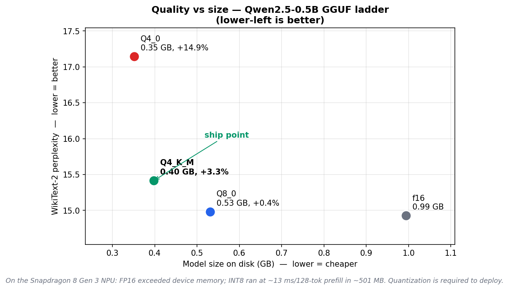

# On-device quantized LLM, profiled on real Qualcomm hardware

Quantize a small LLM across bit-widths, measure the **quality cost** of each, and profile
the **runtime cost** on a **real Snapdragon 8 Gen 3** via Qualcomm AI Hub — then argue which
operating point to ship on a phone, backed by numbers measured on actual silicon.

**Model:** Qwen2.5-0.5B-Instruct (494 M params) · **Quality/prep:** Kaggle GPU + llama.cpp ·
**On-device:** Qualcomm AI Hub cloud (Samsung Galaxy S24, Snapdragon 8 Gen 3 NPU).



## TL;DR — the ship point

- **INT8 runs on the phone NPU:** the quantized transformer backbone profiles at **~13.4 ms / 128-token prefill (~9,500 tok/s) in ~511 MB peak** on a real Samsung Galaxy S24, after exporting with eager attention to keep an unsupported op out of the graph.
- **Q4_K_M is the quality ship point:** at **0.40 GB** it's 2.5× smaller than FP16 for only **+3.3%** perplexity, while naive 4-bit (Q4_0) is barely smaller yet degrades **4.5× more** (+14.9%). INT8 is near-lossless on quality but 33% larger than Q4_K_M.

Net: ship a 4-bit weight format for the smallest footprint and best quality-per-byte; INT8 is
the operating point proven here to run comfortably — sub-1 GB — on the phone NPU.

## Why on-device ≠ server (shown, not asserted)

A GPU server has tens of GB of HBM; a phone NPU (Hexagon HTP) has a small memory budget, runs
integer math, and validates a fixed op set. Two of those bit this project as real results: the
backbone only composed on the NPU after **quantizing to INT8** (~511 MB) and after the ONNX
export was switched to **eager attention** to keep an **unsupported `IsNaN` op** (from the SDPA
attention-mask path) out of the graph — the export asserts zero `IsNaN` nodes before submitting.
With both in place the INT8 graph compiled to QNN DLC and profiled on the real device.

## Results (all measured)

### Quality vs cost — GGUF ladder (llama.cpp)

| Precision | Size (GB) | Eff. bits/wt | WikiText-2 PPL | Δ vs f16 | Verdict |
|-----------|-----------|--------------|----------------|----------|---------|
| f16       | 0.994     | 16.1         | 14.927         | —        | reference |
| Q8_0      | 0.531     | 8.6          | 14.981         | **+0.36%** | near-free |
| **Q4_K_M**| **0.398** | **6.4**      | **15.416**     | **+3.28%** | **ship point** |
| Q4_0      | 0.352     | 5.7          | 17.144         | +14.85%  | dominated |

Perplexity: WikiText-2, llama.cpp `-c 512 --chunks 200`, identical across rows; the f16 row is
the in-track baseline (not the HF number below).

### On-device runtime — AI Hub → Samsung Galaxy S24 (Snapdragon 8 Gen 3 NPU)

| Model | Result |
|-------|--------|
| Qwen-0.5B **INT8** (backbone) → QNN DLC | **13.4 ms / 128-tok prefill · ~9,500 tok/s · 511 MB peak · cold load 11.3 s / warm 0.33 s** ✅ |

Prefill of a 128-token input through the transformer backbone; INT8 weights + activations,
compiled with `--target_runtime qnn_dlc`.

### FP16 baseline (HuggingFace quality anchors)

| Metric | Value | Settings |
|--------|-------|----------|
| Params | 494.0 M | measured |
| FP16 weights | 0.99 GB | measured |
| WikiText-2 perplexity | 12.665 | window 2048 / stride 1024 |
| HellaSwag acc_norm | 0.495 | validation, n=1000, seed=0 (reproduces published ~0.49) |

## Three engineering findings

1. **Nominal ≠ effective bits.** "4-bit" Q4_K_M measured **6.4 bits/weight**, not 4.0 — Qwen-0.5B's
   token-embedding table is ~28% of the model and is kept at higher precision. Small models compress worse.
2. **Perplexity ≠ correctness.** FP16 scores a healthy 12.7 perplexity yet explains "KV cache" *wrong*
   (it describes a key-value store), which is why quality uses a task benchmark (HellaSwag) + a
   qualitative check, not perplexity alone.
3. **On-device deployment is op-gated.** SDPA's attention-mask path emits an `IsNaN` op that the
   Hexagon HTP does not support, so the export switches to eager attention and verifies the exported
   graph contains **zero `IsNaN` nodes** before submitting — the INT8 graph then compiled and ran.

## Method

- **Quantization:** `src/quantize/build_and_quantize.sh` builds llama.cpp and produces the
  f16/Q8_0/Q4_K_M/Q4_0 GGUF ladder; `log_gguf_sizes.py` records sizes + effective bits.
- **Quality:** `baseline.py` (FP16 perplexity + generations), `eval/hellaswag.py` (acc_norm),
  and `llama-perplexity` for the GGUF perplexity ladder.
- **On-device:** export to ONNX (eager attention, backbone), package with external weights,
  `qai-hub` INT8 quantize-job → compile `--target_runtime qnn_dlc --truncate_64bit_tensors` →
  profile on a real S24. Full journey in `src/deploy/AIHUB_NOTES.md`.
- **Trade-off:** `src/viz/pareto.py` renders `results/pareto.png` from `results/metrics.csv`.

## Reliability / honesty checks

- Quantized models compared to the **same-track FP16 baseline**; only **relative** degradation claimed
  (HF-PPL and llama.cpp-PPL never mixed).
- HellaSwag scorer is custom but **reproduces the published 0.49**, validating it for relative use
  (not leaderboard-comparable — stated).
- On-device numbers are from real hardware (the AI Hub inference job on an actual S24), not estimates.
- **Degeneracy check (INT4):** greedy generations across Q8_0 / Q4_K_M / Q4_0
  (`results/generations_quant.md`) stayed **coherent with no repetition collapse** at any bit-width —
  e.g. all three answer "the capital of France is" correctly and produce fluent multi-sentence
  completions, with no looping. This is the qualitative signal; see limitations for the metric.

## Limitations & future work

- The on-device number is **prefill** (128 tokens) through the **transformer backbone** (the final
  vocab projection / `lm_head` was dropped to isolate the backbone). Autoregressive **decode**
  tokens/sec (single-token step with KV cache) is the natural next measurement.
- **FP16 was not profiled on-device in this run** — the on-device evidence here is that INT8 runs,
  not a measured FP16 failure. Profiling the FP16 graph (expected to exceed the NPU memory budget at
  ~2× the INT8 footprint) is future work.
- On-device INT8 used a small **random-token calibration set** — fine for the latency/memory *cost*
  measured here; it is not a quality claim (quality comes from the GGUF track).
- The degeneracy check is **qualitative** as run: the distinct-4gram metric didn't register because
  the verbose `llama-cli` banner-stripping also removed the generated text before scoring. Wiring the
  metric to the captured transcript is a small fix and future work; the transcripts themselves already
  show no collapse.
- Quantized-model HellaSwag and CPU tokens/sec are future work.
- v1 uses 0.5B; a 1.5B model would show a better compression ratio (smaller embedding fraction).

## Reproduce

```bash
python src/baseline/baseline.py            # Phase 1  FP16 perplexity + generations
python src/eval/hellaswag.py --n 1000      # Phase 1b task accuracy
bash   src/quantize/build_and_quantize.sh  # Phase 2a GGUF ladder (build + quantize)
python src/quantize/log_gguf_sizes.py      # Phase 2a sizes + effective bits
bash   src/eval/gguf_perplexity.sh         # Phase 2b perplexity per GGUF
python src/deploy/aihub_profile.py         # Phase 3  compile + profile on real Snapdragon (needs qai-hub auth)
python src/eval/degeneracy.py              # Phase 4  INT4 degeneracy check
python src/viz/pareto.py                   # Phase 5  the Pareto chart
```

